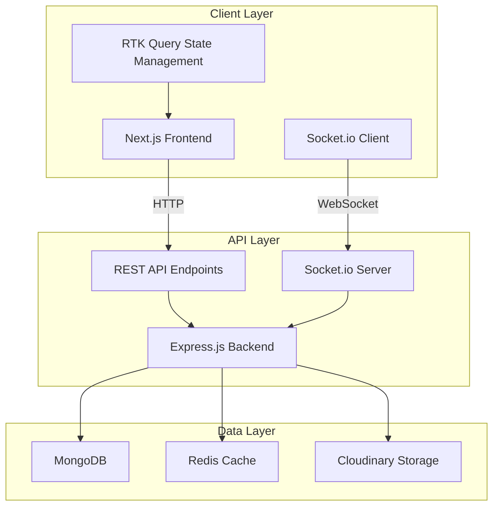
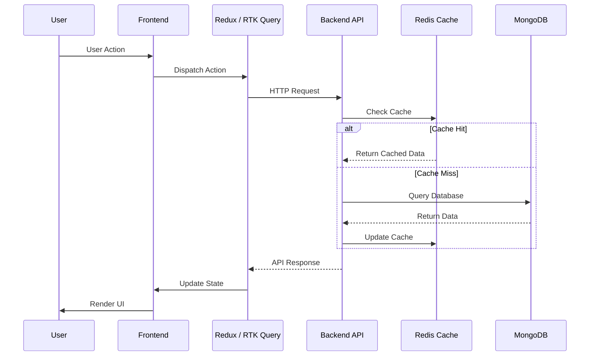
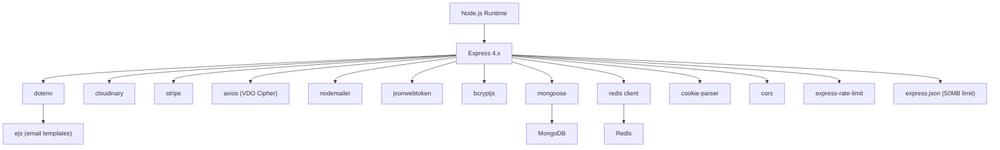
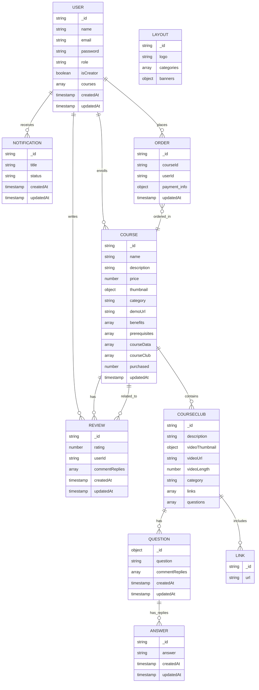
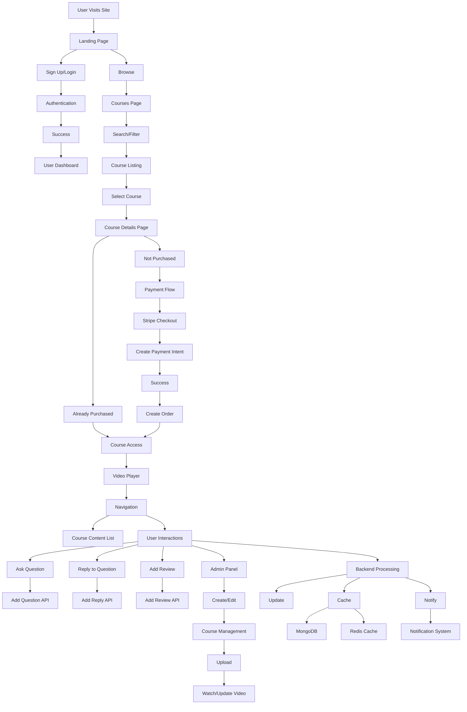
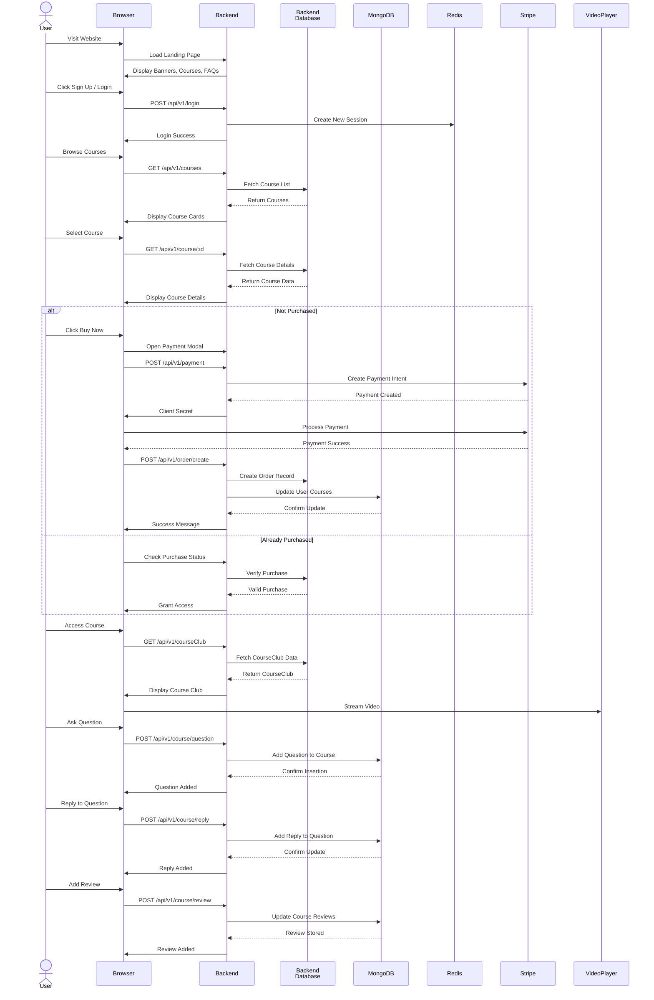
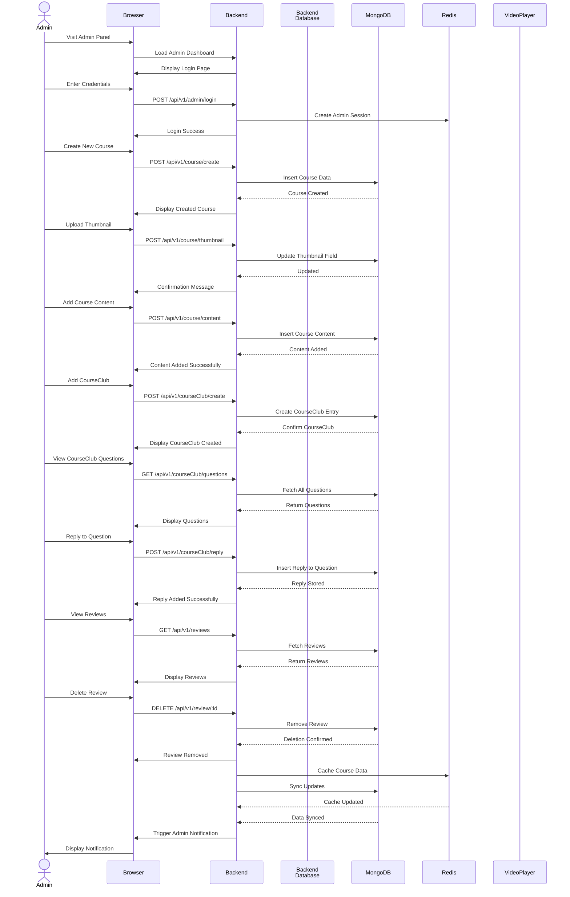

# Complete Case Study - Learnix LMS

## Overview

**Learnix LMS** is a full-featured **Learning Management System** built with **Next.js** with **Typescript** in frontend and **Node.js** and **Express** with **Typescript** in the backend. The system provides **RESTful APIs** for managing online courses, user authentication, course enrollment, payment processing, content delivery, and analytics. It follows a **multi-layered architecture** ensuring clear separation of concerns between routing, business logic, and data access.

### System is designed to support :

o- **Multi-role user management** (Admin & Regular users)

o- **Course creation & content management** with video streaming

o- **Secure payment processing** via **Stripe**

o- **Interactive learning features** — questions, replies, and reviews

o- **Real-time notifications**

o- **Administrative analytics & reporting**

o- **Dynamic layout management** for frontend content

---

## Project Goals

**Learnix LMS** is a community-driven platform built to help beginner developers grow into confident, industry-ready software engineers. It bridges the gap between theory and practice by offering curated lessons, real-world projects, and expert guidance—focusing on learning by doing rather than just consuming tutorials.

o- **Beginner-friendly, practical learning:** Emphasizes real-world application of concepts to build strong engineering foundations.  
o- **Community-driven growth:** Encourages mentorship, collaboration, and peer feedback in a supportive environment.  
o- **Progress through consistency:** Inspires learners to improve *“one commit, one concept, one breakthrough at a time.”*

---

## System Architecture Overview

**Learnix LMS** follows a **three-tier architecture** consisting of a **Node.js/Express backend**, **MongoDB database**, and **Next.js frontend**.  
This design ensures scalability, modularity, and smooth integration between client and server.

| Layer | Description | Key Components / Features |
|:------|:-------------|:--------------------------|
| **Backend Layer** | Built with **Express.js**, exposing RESTful APIs for core LMS operations. | - **User Management (`/api/v1/user`)** – Authentication, registration, profiles   - **Course Management (`/api/v1/course`)** – Courses, questions, reviews   - **Order Processing (`/api/v1/order`)** – Purchases, Stripe payments   - **Notifications (`/api/v1/notifications`)** – Real-time system updates   - **Analytics (`/api/v1/analytics`)** – Usage and performance tracking   - **Layout (`/api/v1/layout`)** – Manage banners, FAQs, categories    **Extras:** Rate limiting (100 req / 15 min / IP), middleware for errors & cookies |
| **Data Layer** | Uses **MongoDB** with **Mongoose ODM** for data modeling and schema validation. | - **User Model:** Credentials, bcrypt hashing, JWT tokens   - **Course Model:** Course content, videos, reviews, discussions   - **Order Model:** Purchase and payment tracking |
| **Frontend Layer** | Built using **Next.js 13+** and **React**, providing a seamless user experience. | - **Redux Toolkit + RTK Query:** State and API management   - **Socket.io Client:** Real-time communication   - **NextAuth:** Session and authentication management   - **API Slices:** Modular endpoints (analytics, layout, orders) |
| **Security Features** | Ensures data safety and controlled access across the system. | - **JWT Authentication:** Access (5 min) & refresh (3 days) tokens   -  **CORS:** Configured for specific frontend origin   - **Password Hashing:** Bcrypt encryption for user credentials |

---

## System Architecture Diagram

## System Data flow

---

## Key Features 

Learnix is a community-driven Learning Management System (LMS) designed for aspiring developers who want to build real-world skills. It combines technical depth with collaborative learning to help users go beyond tutorials and start shipping production-ready applications.

### 1- Course Management

Learnix supports comprehensive course structures with the following features:

o- **Video-based learning**  
  Each course includes thumbnails, demo URLs, and structured video sections.

o- **Benefits and prerequisites tracking**  
  Courses define clear learning outcomes and entry requirements.

o- **Reviews and ratings system**  
  Students can leave feedback and rate courses from 1 to 5 stars.

o- **Q&A functionality**  
  Threaded question replies allow detailed discussions between students and instructors.

### 2- Technical Features

o- **Real-time communication**  
  Socket.io integration enables live interactions across the platform.

o- **Theme support**  
  Dark/light mode with smooth transitions for personalized viewing.

o- **Main sections**  
  Includes hero landing, course catalog, reviews, and FAQ components.

### 3- Course Creation & Administration

o- **Multi-step course creation workflow**  
  Admins define course name, description, pricing, tags, categories, difficulty level, demo URL, and thumbnail.

o- **Benefits & prerequisites**  
  Multiple learning outcomes and entry requirements per course.

o- **Video content structure**  
  Lessons include video URLs, titles, descriptions, length tracking, and resource links.

o- **Full CRUD operations**  
  Admins can create, read, update, and delete courses via dedicated API endpoints.

o- **Course listing dashboard**  
  Data grid interface with ratings, purchase counts, creation dates, and edit/delete actions.

### 4- Interactive Learning Features

o- **Q&A System**  
  o- Students post questions linked to specific video content.  
  o- Instructors receive notifications for new questions.  
  o- Threaded replies support detailed discussions.

o- **Review & Rating System**  
  o- Students submit reviews and star ratings.  
  o- Admins can reply with access-controlled responses.  
  o- Ratings are calculated and displayed with review counts.

### 5- Student Learning Experience

o- **Video Player & Navigation**  
  o- Authenticated students access purchased content.  
  o- Previous/next controls with disabled states at boundaries.  
  o- Tabbed interface for Overview, Resources, Q&A, and Reviews.

o- **Course Discovery**  
  o- Category filtering with visual interface.  
  o- Responsive course cards with search functionality.  
  o- Dedicated course pages with full details and reviews.

### 6- Payment & Enrollment

o- **Stripe integration**  
  Secure payment processing with dynamic pricing.

o- **Purchase verification**  
  Enrollment is restricted to users who have purchased the course.

### 7- Learning Platform Capabilities

o- **Beginner-friendly, industry-ready approach**  
  Bridges the gap between theory and practice with curated lessons, hands-on challenges, and expert insights.

o- **Real-world workflows**  
  Every module reflects actual engineering practices—not just textbook examples.

o- **Community collaboration**  
  A vibrant space where feedback is constructive, mentorship is accessible, and progress is visible.

### 8- Real - time Notifications to admins

o- **Course Purchased Notification**  
  Whenever someone purchased a course then a real time notification with sound plays at admin side with all the details of user who purchased the course.

o- **New Review added Notification**  
  Whenever a student added a review to the course then also a real time notification is added to the admin side to notify the admin about the review.

o- **Discussion in Q/A Notifications**  
  Discussion about the course in the Q/A section notifies the admin about the issues that student are facing in the course.

---

## API Architecture

Learnix features an organized RESTful API structure, with endpoints grouped by business domain for clarity and scalability:

o- **User Authentication & Profiles**  `/api/v1/user/*`

o- **Course Catalog Operations**  `/api/v1/course/*`

o- **Order Processing**  `/api/v1/order/*`

o- **Notification System**  `/api/v1/notifications/*`

o- **Analytics & Reporting**  `/api/v1/analytics/*`

o- **Layout Customization**  `/api/v1/layout/*`

---

## Tech Stack

---
### Backend

- **Node.js (v18.x)** – JavaScript runtime for server-side applications
- **Express.js (v5.1.0)** – Web application framework
- **MongoDB + Mongoose (v8.18.1)** – NoSQL database with object modeling
- **JWT (jsonwebtoken v9.0.2)** – Token-based authentication
- **bcryptjs (v3.0.2)** – Password hashing
- **Nodemailer (v7.0.6)** – Email handling
- **Stripe (v19.3.0)** – Payment processing

**Additional Backend Tools:**

- **TypeScript (v5.9.2)** – Type-safe JavaScript
- **Redis (ioredis v5.7.0)** – Caching and session management
- **EJS (v3.1.10)** – Email templating
- **express-rate-limit (v8.2.1)** – API rate limiting

### Frontend

- **Next.js (v13.5.11)** – React framework (not Vite)
- **React (v18)** – UI library
- **Redux Toolkit (v2.9.0)** – State management

**Additional Frontend Tools:**

- **TypeScript (v5)** – Type safety
- **Tailwind CSS (v3)** – Utility-first styling
- **Material-UI (v7.3.4)** – Component library
- **NextAuth (v4.24.11)** – Authentication

### File & Media Handling

- **Cloudinary (v2.7.0)** – Cloud-based media storage
  
### Real-time Communication

- **Socket.io** – Bi-directional communication for notifications

### Development & Deployment

- **ts-node-dev (v2.0.0)** – Development server with auto-restart
- **dotenv (v17.2.2)** – Environment variable management
- **Vercel** – Deployment platform (frontend hosted at [lms-frontend-plum-three.vercel.app ↗](https://learnix-lms.vercel.app/))
- **Render** – Deployment platform (backend hosted at [learnix-lms-backend.onrender.com ↗](https://learnix-lms-backend.onrender.com))
- **Socket Server** hosted on **Render** at [learnix-socket-server-lms.onrender.com ↗](https://learnix-socket-server-lms.onrender.com).

---

## Challenges and Solutions

| Challenge                                                                                   | Solution                                                                                          |
|---------------------------------------------------------------------------------------------|---------------------------------------------------------------------------------------------------|
| JWT setup was confusing due to access/refresh token lifecycle                              | Implemented proper token rotation and refresh logic for seamless authentication flow             |
| Purchased count not updating during order creation                                          | Used Mongoose’s `$inc` operator to increment the count reliably during order processing          |
| Cache not updating after data changes                                                      | Added logic to update Redis cache after mutations to maintain consistency                        |
| Vdocipher integration errors while fetching and displaying videos                          | Debugged API flow and resolved frontend/backend sync issues for smooth playback                  |
| TypeScript model and relationship errors                                                    | Learned advanced TypeScript patterns and fixed model definitions and schema joins                |
| Frontend API setup issues with Vdocipher                                                    | Spent time understanding Vdocipher’s frontend flow and resolved integration bugs                 |
| Tailwind screen config broke responsive classes                                             | Researched and corrected screen setup using community help and GPT                               |
| UI/UX issues in admin panel and course overview component                                   | Refactored layout and logic to improve design and usability in critical admin views              |
| Business logic errors in course creation and review system                                  | Refined controller logic and added validation to ensure correct review and course data handling  |
| Debugging nested Q&A replies and review threading                                           | Adjusted schema and frontend rendering to support recursive replies and admin moderation         |

---

## Database Design

---

## Application Flow Diagram

---

## User Flow

## Admin Flow

---

## Best Practices

### TypeScript Integration (Frontend & Backend)
The entire Learnix LMS project is built using **TypeScript** across both frontend and backend layers.  
This ensures **strong type safety**, **better scalability**, and **early error detection** during development.  
By enforcing strict type definitions, it reduces runtime bugs and improves maintainability across complex modules such as course management, authentication, and data processing.

### Secure Authentication with Access & Refresh Tokens
For robust security, the backend uses a combination of **Access Tokens** and **Refresh Tokens**.  
This approach enhances **session security**, prevents unauthorized access, and allows seamless token renewal without requiring users to log in repeatedly.  
It follows modern security standards for **JWT-based authentication** and **token lifecycle management**.

### Efficient State Management with RTK Query
The frontend leverages **RTK Query**, a part of Redux Toolkit, for efficient and real-time state synchronization.  
This enables **automatic caching**, **data fetching**, and **revalidation** of API calls, significantly reducing boilerplate code and improving app performance.  
It ensures that Learnix LMS delivers a responsive and up-to-date experience even under heavy data flow.

### Enhanced User Experience (UX)
The platform is designed with a focus on **clarity, accessibility, and ease of use**.  
From intuitive navigation to consistent interface elements, Learnix LMS ensures users can engage with courses, dashboards, and content smoothly.  
A responsive layout and clear feedback mechanisms contribute to a seamless learning experience across devices.

--- 

## Conclusion

Learnix LMS stands out as a complete, scalable, and production-ready Learning Management System.  
It unites learners, instructors, and administrators in one collaborative ecosystem focused on real-world skill development.  
With robust authentication, a TypeScript-based architecture, and seamless state management through RTK Query, it ensures reliability and performance. Designed for both growth and community engagement, Learnix LMS bridges theory and practice to help developers become industry-ready professionals.

